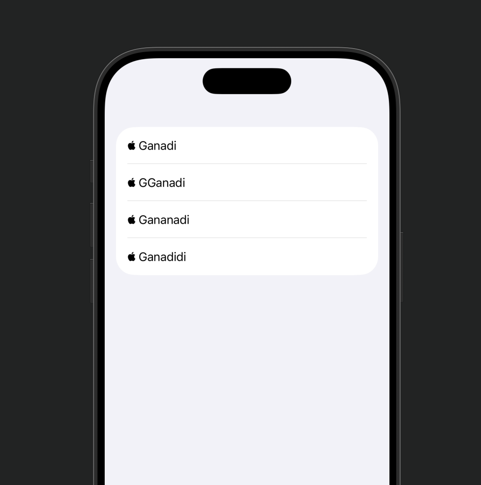
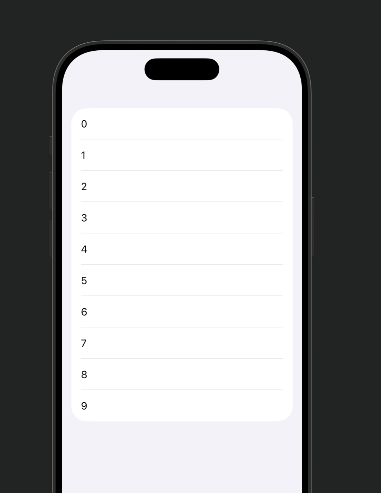

# SwiftUI List 완전 정리

## 01 List란?
- SwiftUI에서 **세로 스크롤 리스트 UI**를 만드는 기본 컨테이너
- UIKit의 `UITableView` 느낌
- 데이터 기반 UI 구성에 핵심적으로 사용됨

---

## 02 기본 구조

- `List` 안에 들어가는 View 하나 = 하나의 row

→ 예시
```swift
List {
    Text("→ ganadi1")
    Text("→ ganadi2")
}
````

---

## 03 정적 리스트 vs 동적 리스트

### → 정적 리스트

* 데이터를 직접 하드코딩해서 넣는 방식
* 간단한 UI에서 사용

```swift
List {
    Text("→ ganadi 커피")
    Text("→ ganadi 우유")
    Text("→ ganadi 주스")
}
```

---

### → 동적 리스트

- 데이터를 기반으로 자동 생성됨
- 실무에서 거의 이거 씀

---

## 04 동적 리스트 만드는 방법

### → 1. Range 사용

```swift
List(0..<5) {
    Text("→ ganadi \($0)")
}
```

- 숫자 범위로 반복 생성
- 간단 테스트용

---


### → 2. 배열 + id

```swift
let data = ["ganadi1", "ganadi2", "ganadi3"]

List(data, id: \.self) {
    Text("→ \($0)")
}
```

- `id: \.self` → 각 요소 자체를 식별자로 사용

---

### → 3. Identifiable (⭐ 가장 중요)

```swift
struct Ganadi: Identifiable {
    let id = UUID()
    let name: String
}

let data = [
    Ganadi(name: "ganadi1"),
    Ganadi(name: "ganadi2")
]

List(data) {
    Text("→ \($0.name)")
}
```

- SwiftUI는 **각 row를 구분할 수 있어야 렌더링 가능**
- 그래서 반드시 `id` 필요

👉 실무에서는 대부분 이 방식 사용

---


## 05 ForEach (List 내부 반복)

- List 안에서 동적 반복 처리할 때 사용
- 정적 + 동적 섞을 때 필수

```swift
List {
    Text("→ ganadi 리스트 시작")

    ForEach(0..<3) {
        Text("→ ganadi \($0)")
    }

    Text("→ ganadi 리스트 끝")
}
```

---

## 06 Section (구역 나누기)

- 리스트를 카테고리별로 나눌 수 있음

```swift
List {
    Section(header: Text("→ ganadi 음료")) {
        Text("→ ganadi 커피")
        Text("→ ganadi 주스")
    }

    Section(header: Text("→ ganadi 디저트")) {
        Text("→ ganadi 케이크")
    }
}
```

### → footer 추가도 가능

```swift
Section(
    header: Text("→ ganadi 음료"),
    footer: Text("→ ganadi 끝")
)
```

---

## 07 List 스타일

```swift
.listStyle(.insetGrouped)
```

### → 주요 스타일

- `.plain`
- `.grouped`
- `.insetGrouped`
- `.sidebar`

👉 기능은 동일, UI만 변경됨

---

## 08 삭제 기능 (onDelete)

```swift
@State var data = [
    Ganadi(name: "ganadi1"),
    Ganadi(name: "ganadi2")
]

List {
    ForEach(data) {
        Text("→ \($0.name)")
    }
    .onDelete(perform: delete)
}

func delete(at offsets: IndexSet) {
    data.remove(atOffsets: offsets)
}
```

👉 swipe 해서 삭제 가능

---

## 09 이동 기능 (onMove)

```swift
List {
    ForEach(data) {
        Text("→ \($0.name)")
    }
    .onMove(perform: move)
}
```

```swift
func move(from: IndexSet, to: Int) {
    data.move(fromOffsets: from, toOffset: to)
}
```

👉 `EditButton()` 필요

---

## 10 EditButton

```swift
.navigationBarItems(trailing: EditButton())
```

- 삭제 / 이동 활성화 버튼

---

## 11 선택 (Selection)

### → 여러 개 선택

```swift
@State var selected = Set<UUID>()

List(data, selection: $selected) {
    Text("→ \($0.name)")
}
```

### → 하나 선택

```swift
@State var selected: UUID?
```

---

## 12 리스트 커스터마이징

### → row 여백 제거

```swift
.listRowInsets(EdgeInsets())
```

---

### → separator 숨기기

```swift
.listRowSeparator(.hidden)
```

---

### → 배경 제거

```swift
.scrollContentBackground(.hidden)
```

---

## 13 NavigationLink (리스트 클릭 이동)

```swift
NavigationStack {
    List(data) { item in
        NavigationLink {
            Text("→ ganadi 상세")
        } label: {
            Text("→ \(item.name)")
        }
    }
}
```

👉 리스트 클릭 시 화면 이동

---

## 14 성능 특징

- Lazy 로드 방식 (보이는 것만 그림)
- 데이터 많아도 성능 유지됨
- 대신 id 관리 잘해야 함

---

## 15 핵심 정리

- List = SwiftUI 기본 리스트 UI
- 동적 데이터 = 필수
- id 없으면 렌더링 불가
- ForEach = 반복 처리
- Section = 구역 나누기
- onDelete / onMove = 인터랙션
- NavigationLink = 화면 이동

---

## 16 한줄 요약

→ List는 데이터 기반으로 UI를 그리는 SwiftUI의 핵심 컨테이너