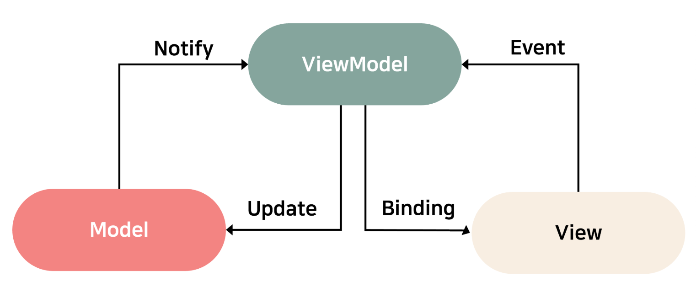
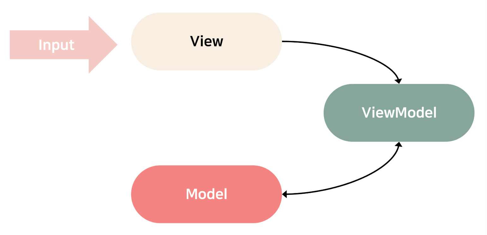
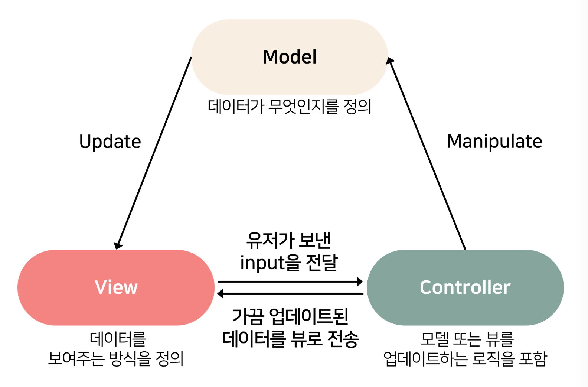

# MVVM 패턴
MVVM ( Model - View - ViewModel ) 은 소프트웨어 개발에서 UI를 만들 때 사용하는 패턴 

- Model, View, ViewModel 세가지 구성 요소로 나누어 설계
- MVC 패턴과 유사하지만, Controller 대신 ViewModel이라는 새로운 새념 도입

### ViewModel

- - View를 표현하기 위해 만들어진 View만을 위한 Model
- - Model을 View에 표시하기 위한 처리를 하는 부분
- - Model로 부터의 처리 결과를 View에 통지하고, View의 요청에 따라 로직을 실행

 
 

ViewModel의 특징은  Data Binding과 캡슐화된 Command 패턴을 이용하여 View와 Model 간 결합도를 없애면서 View와 Model 사이에서 중간 관리자의 역할을 완벽하게 수행

.

.

.

# MVVM 패턴의 동작 방식

 
 

1. View를 통해 사용자의 Action들이 들어옴
2. View에 Action이 들어오면, Command 패턴으로 ViewModel에 Action을 전달
3. ViewModel은 Model에게 데이터를 요청
4. Model은 ViewModel에게 요청받은 데이터를 응답
5. View는 ViewModel과 Data Binding하여 화면을 나타냄

### MVVM 패턴의 장단점

- 장점
    - View와 Model의 독립성 유지 가능
    - 독립성을 유지하기 때문에 효율적인 유닛테스트가 가능
    - View와 ViewModel을 바인딩하기 때문에 코드의 양 감소
    - UI와 데이터 처리를 분리하여 코드를 재사용
    - 유지보수가 용이

- 단점
    - View - Model의 설계가 쉽지 않음

.

.

.

# MVC 패턴
MVC ( Model, View, Controller ) 은 소프트웨어 개발에서 UI를 만들 때 사용하는 패턴

 
 

- 사용자 인터페이스, 데이터 및 논리 제어를 구현하는데 널리 사용되는 소프트웨어 디자인 패턴
- 소프트웨어의 비즈니스 로직과 화면을 구분하는데 중점을 둠
- UI를 Model, View, Controller 세 가지 구성 요소로 나누어 설계
    - Model은 데이터와 비즈니스 로직을 담당,
    - View는 사용자에게 보이는 화면을 처히라는 역할,
    - Controller는 사용자의 요청을 어떻게 처리할지를 결정, Model과 View 사이에서 상호작용을 조율하는 역학을 하며, 사용자의 요청을 받아 Model의 데이터를 갱신하고 View에 반영

### Model

- - 앱이 포함해야할 데이터가 무엇인지를 정의, 데이터의 상태가 변경되면 필요한대로 화면을 변경할 수 있도록 뷰에게 알리며 업데이트된 뷰를 제거하기 위해 다른 로직이 필요한 경우에는 컨트롤러에게 알림